# 微头条写作使用指南

## 1. 本 Skill 的用途

Skill 一句话简介：本指南通过 开头写作Skill 和 正文写作Skill，完成从素材整理到微头条初稿的流程，生成多个微头条候选开头及正文，帮助缩短选题和起稿时间。
适用人群：已完成 Skill 安装、会进行基础对话，但不熟悉如何把素材组织成可生成内容的用户

## 2. 适用场景与不适用场景

**最核心的2个高频适用场景：**

- 不知道某个话题该写什么内容：可以用 Skill 总结提炼观点，作为起稿方向；
- 不知道某个话题怎么写：可以用 Skill 生成开头和正文。

**不适用场景：**

- 生成长篇文章及标题：该Skill仅支持生成观点明确的热点短内容

## 3. 如何5分钟快速上手

### 第一步：快速找素材

**1. 先找话题：** 打开手机头条热榜，点击打开感兴趣的话题

**2. 形成观点：** 查看话题详情和评论区高赞评论，结合事件信息，形成想法

- 如果有自己的初步想法：写下自己的想法
- 如果暂时没有明确想法：借鉴高赞评论观点，转化为自己的观点，用自己的话描述出来，作为补充

**3. 按照模板整理输入素材：** 

输入素材是指在输入至AI对话框的话题素材。

**输入素材模板：**

```
热榜话题：
我的观点：
补充观点：
```

**找素材过程示范：**

1. 查看头条热榜，选中感兴趣，建议选择正能量的词条
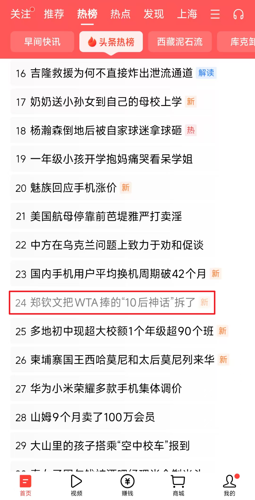
2. 进去后可以查看事件基本信息，知道时间主人公之前的伤痛经历，现在经过调节之后，重新获得大满贯可以提取出观点
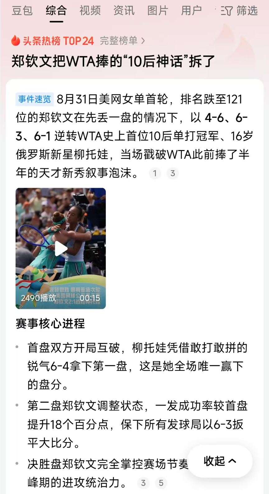
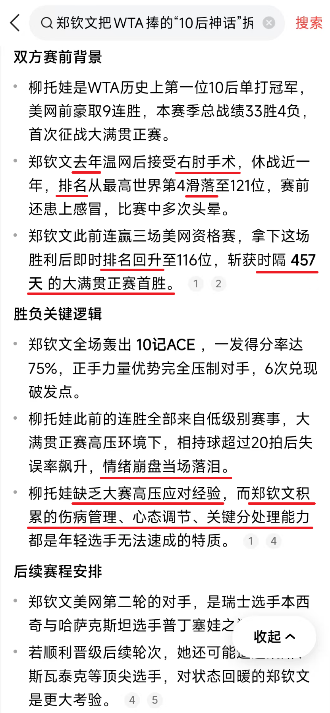
3. 查看部分高赞评论，提到教练的表情，是可以写的一个细节
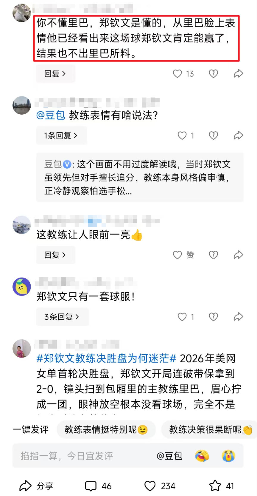
4. 大部分的评论都在抢到主人公的心态变化
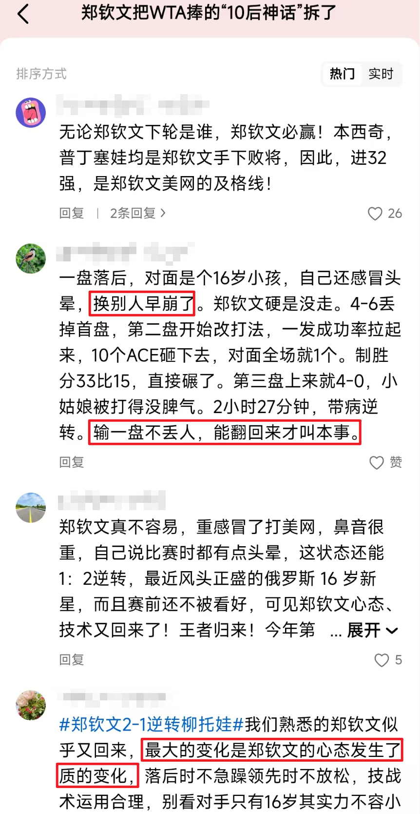

> **输入素材示例：**  
> 
> **热榜话题：** 郑钦文把WTA捧的“10后神话”拆了  
> **我的观点：** 心态很重要，郑钦文前面的伤病给她带来了不少成长，让她知道如何在压力下更好地调节，自然冠军也是水到渠成。  
> **补充观点：**  
> 1、郑打球要控制节奏，不要每个球都抡，领先时候要懂得给对手压力，自己不要轻易失误  
> 2、教练里巴表情略显迷茫：“你不懂球，郑钦文是懂的，从里巴脸上表情他已经看出来这场球郑钦文肯定能赢了，结果也不出里巴所料

**其他问题：**

如果不知道选哪个话题怎么办？
可以使用我的推荐：将头条热榜复制下来，贴到网页AI对话框，再输入话题范围及提示词“按照我给的话题范围选出符合要求的热点话题”

### 第二步：按模板输入

这一步本 Skill 会根据输入素材进行话题背景搜索，生成信息摘要，提取出可以用到的观点、写作元素

**1. 调用 Skill：**

在 AI 对话框输入“/”调用Skill “beginning-write-v4” 

> /beginning-write-v4

**2. 将整理好的输入素材粘贴进对话框：**
> **热榜话题：** 郑钦文把WTA捧的“10后神话”拆了  
> **我的观点：** 心态很重要，郑钦文前面的伤病给她带来了不少成长，让她知道如何在压力下更好地调节，自然冠军也是水到渠成。  
> **补充观点：**  
> 1、郑打球要控制节奏，不要每个球都抡，领先时候要懂得给对手压力，自己不要轻易失误  
> 2、教练里巴表情略显迷茫：“你不懂球，郑钦文是懂的，从里巴脸上表情他已经看出来这场球郑钦文肯定能赢了，结果也不出里巴所料

**3. 发送对话：**
> /beginning-write-v4
> **热榜话题：** 郑钦文把WTA捧的“10后神话”拆了  
> **我的观点：** 心态很重要，郑钦文前面的伤病给她带来了不少成长，让她知道如何在压力下更好地调节，自然冠军也是水到渠成。  
> **补充观点：**  
> 1、郑打球要控制节奏，不要每个球都抡，领先时候要懂得给对手压力，自己不要轻易失误  
> 2、教练里巴表情略显迷茫：“你不懂球，郑钦文是懂的，从里巴脸上表情他已经看出来这场球郑钦文肯定能赢了，结果也不出里巴所料


> 提示：  
> 本案例中的赛事数据由Skill检索公开资料后生成。涉及具体事实时，请以原始公开来源为准。  
> 评论区内容仅用于了解不同观点，不作为事实依据。  
> 使用输出结果前用户需对关键事实与来源进行人工核对。

**输出内容：** 话题背景、观点、写作元素，并且会给你多个选项以供选择。

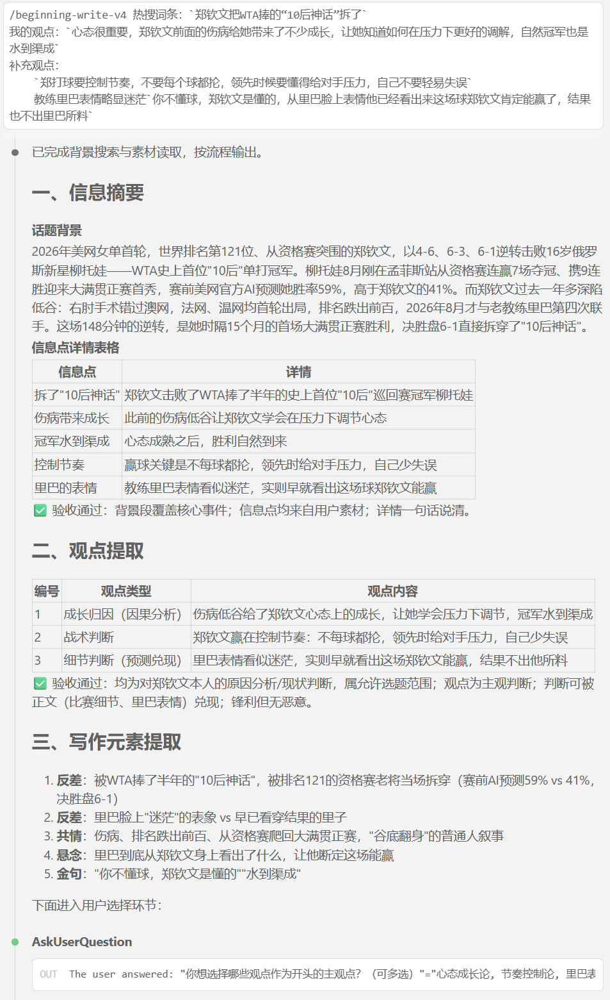


### 第三步：根据提示选择观点角度

从大模型给的多个观点及钩子元素中，选择你想要的观点和元素并提交，如果无法决定，则可以全选。
本案例全选选项作为参考，实际使用时，可根据实际选项内容选择。


**输出内容：** 5 个候选开头


### 第四步：初步选 3 个可用开头

从生成结果中选择最接近你想表达观点的几条开头，并且符合以下基本要求：

- 内容主题没有跑偏
- 事实表述正确
- 语气基本符合个人表达习惯的一条或多条开头

本案例选3个开头作为演示，实际使用时，可选1-5个任意数量

> 候选1/4/5

**输出内容：**


### 第五步：根据选定开头生成正文

快速上手部分优先完成整个流程；如后续需调整开头，请参阅第 4、5 节。

**对话框输入指令，直接写正文：**
> 根据上文已确定的事件信息、核心观点和选定开头，撰写3篇微头条正文。  
> 要求：衔接开头，不补充未提供或未经核实的事实，字数180至220字。

**输出结果：**
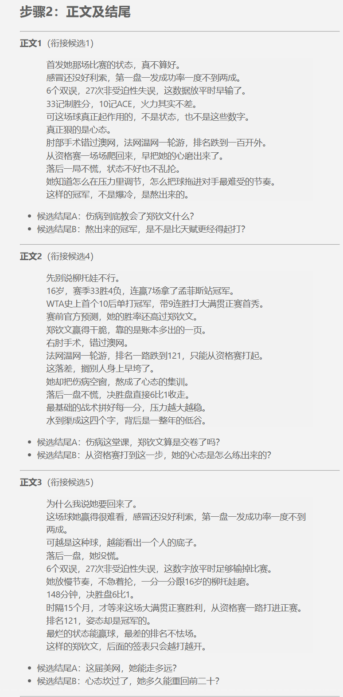

如果改用新的对话窗口丢失上下文、未自动调用正文 Skill 或 AI 未接收到候选开头信息，则按照以下步骤处理。

**1. 调用写正文 Skill：**
> /body-write 根据以下已确定的事件信息、核心观点和选定开头，撰写3篇微头条正文。  
> 要求：衔接开头，不补充未提供或未经核实的事实，字数180至220字。

**2. 输入交接信息：**
> **标准交接模板：** 选定开头为必填项，其他为可选项  
> 事件事实：  
> 核心观点：  
> 选定开头：（必填，将选定的候选开头复制进对话框）  
> 可使用事实：  
> 不得补充的信息：  
> 语气：  

**3. 发送指令：**
> /body-write 根据以下已确定的事件信息、核心观点和选定开头，撰写3篇微头条正文。  
> 要求：衔接开头，不补充未提供或未经核实的事实，字数180至220字。
> 事件事实：  
> 核心观点：  
> 选定开头：（必填，将选定的候选开头复制进对话框）  
> 可使用事实：  
> 不得补充的信息：  
> 语气：  

### 完整版案例

**第一步素材整理：**

> 热搜词条：郑钦文把WTA捧的“10后神话”拆了  
> 我的观点：心态很重要，郑钦文前面的伤病给她带来了不少成长，让她知道如何在压力下更好得调节，自然冠军也是水到渠成  
> 补充观点：  
> 1、郑打球要控制节奏，不要每个球都抡，领先时候要懂得给对手压力，自己不要轻易失误  
> 2、教练里巴表情略显迷茫：“你不懂球，郑钦文是懂的，从里巴脸上表情他已经看出来这场球郑钦文肯定能赢了，结果也不出里巴所料

**第二步输入：** 调用Skill并粘贴整理好的素材


**候选结果：**


以上观点都可以，下一步可以全选。

**第三步输入：** （观点角度尚可，全选后先生成一波开头）


**候选结果：**
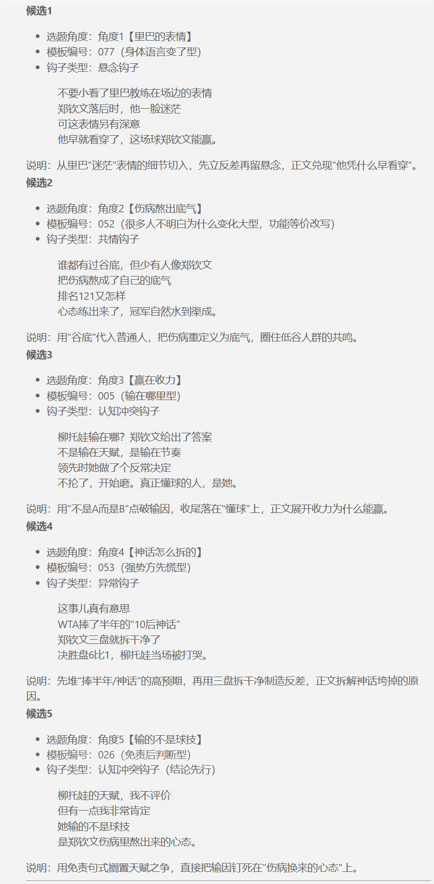

**微调：** （由于第一波生成的开头个人主管觉得不够好，于是又生成了一波）


**输出结果：**


**第四步输入：** 候选1/4/5


**输出结果：**
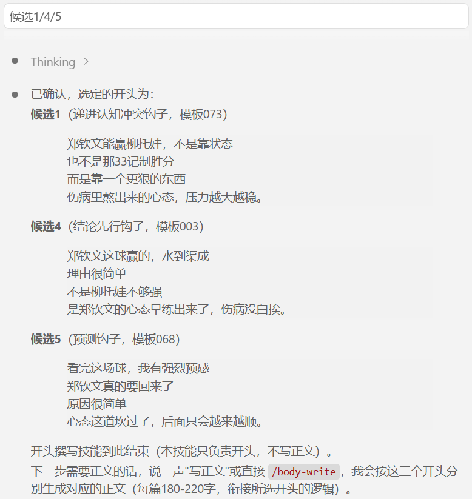

**第五步输入：** 写正文


**输出结果：**
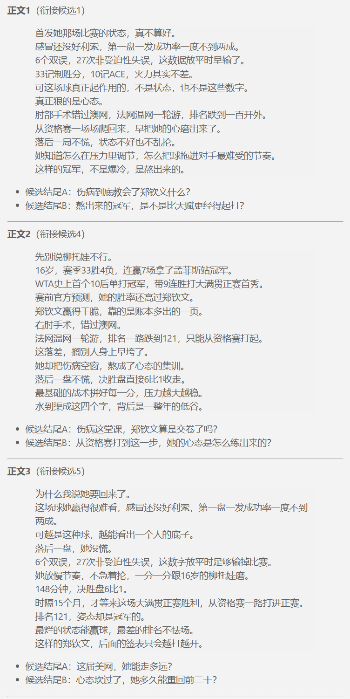

**微调：** 修改正文2为感叹语气
**输出结果：**
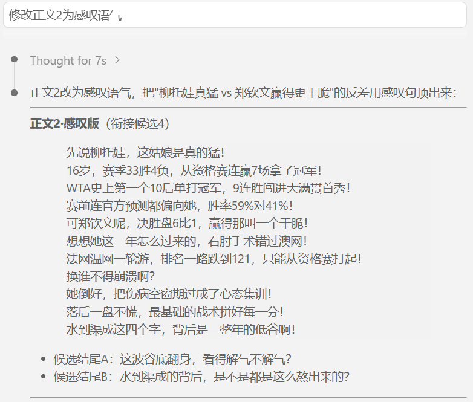

**最终正文：**
> 郑钦文这球赢的，水到渠成  
> 理由很简单  
> 不是柳托娃不够强  
> 是郑钦文的心态早练出来了，伤病没白挨。
> 
> 先说柳托娃，这姑娘是真的猛！  
> 16岁，赛季33胜4负，从资格赛连赢7场拿了冠军。  
> WTA史上第一个10后单打冠军，9连胜闯进大满贯首秀。  
> 赛前连官方预测都偏向她，胜率59%对41%！  
> 可郑钦文呢，决胜盘6比1，赢得那叫一个干脆！  
> 想想她这一年怎么过来的，右肘手术错过澳网。  
> 法网温网一轮游，排名一路跌到121，只能从资格赛打起。  
> 换谁不得崩溃啊？  
> 她倒好，把伤病空窗期过成了心态集训。  
> 落后一盘不慌，最基础的战术拼好每一分。  
> 水到渠成这四个字，背后是一整年的低谷啊！（感叹号删除大部分，只留下确实可以用感叹语）  
> 
> 这波谷底翻身，看得太解气了。（改为陈述句，抒发感叹，找读者共鸣）

## 4. 如何挑选并优化生成结果

### 4.1 先判断是否可用

- 前两句是否直接明确提及具体事件或人物？
- 是否有明确切入点？
- 观点是否鲜明？
- 开头是否能够制造信息缺口；
- 是否存在夸大或未经证实的说法？
- 是否符合账号平时的表达风格、字数要求？

### 4.2 可以手动修改的情况

适用于主题正确、观点可用，只是表达不够理想：

- 太长或太短：删减或补足关键信息；
- 语气不符：替换过激、生硬表达；
- 开头不够直接：将事件或人物直接提前；
- 观点不够鲜明：补充真实观点，而不是堆砌形容词。

### 4.3 应重新生成的情况

适用于方向本身错误：

- 理解错事件、混淆人物或事实；
- 没有体现你提供的观点；
- 全部候选偏离预期风格；
- 内容涉及无法核实的判断或明显风险。

## 5. 结果不符合预期时

根据问题补充要求后重新生成：

|现象|追加指令|
|---|---|
|偏离事件|仅围绕【事件】展开，不补充未提供的事实。|
|观点太弱|突出【某观点】，开头需要有明确判断。|
|语气不符|改为【理性/犀利/共情】语气，避免【某类表达】。|
|字数不符|控制在40-60字。|
|句式重复|换一个切入角度，避免套用【原句式】。|

## 6. 使用技巧与注意事项

避坑指南：避免连续使用高度相仿的开头句式；对同一素材至少更换切入角度、观点表达和关键信息。发布前以平台最新规则为准。

提示：文字创作是没有标准答案的过程，过度依赖 AI 创作会变得没有辨别决策能力，当无法判断效果时，可以在符合平台规则与事实要求的前提下进行小范围测试，并记录数据与反馈。

## 重要提示：发布前必须检查

字数在200字以上。
勾选【首发】。
检查事实、风险和平台规范，符合要求再发布。
