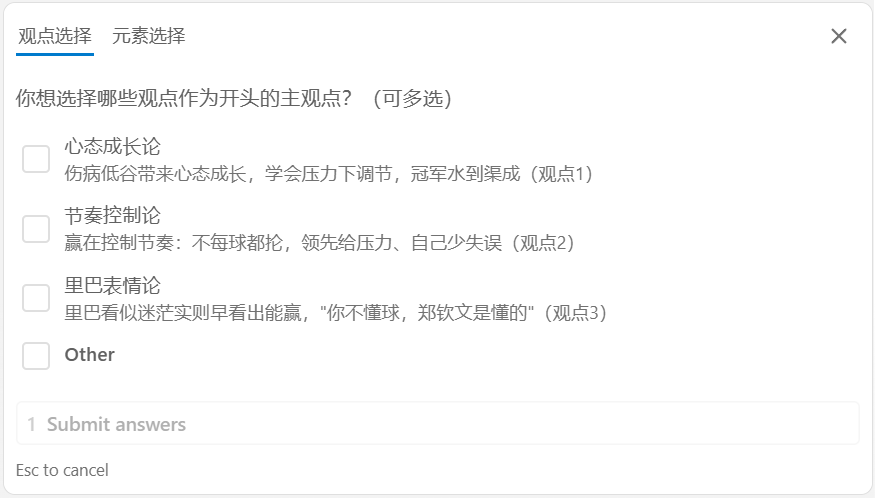
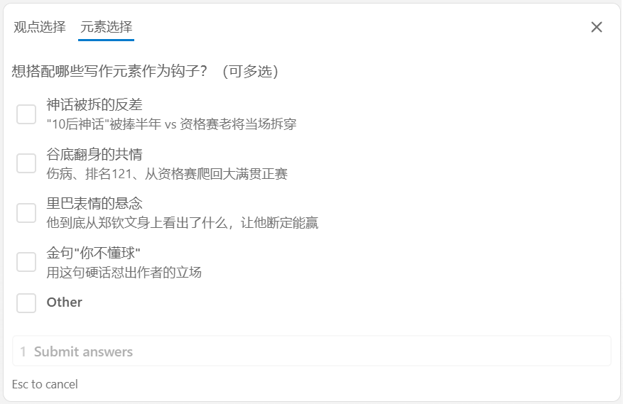
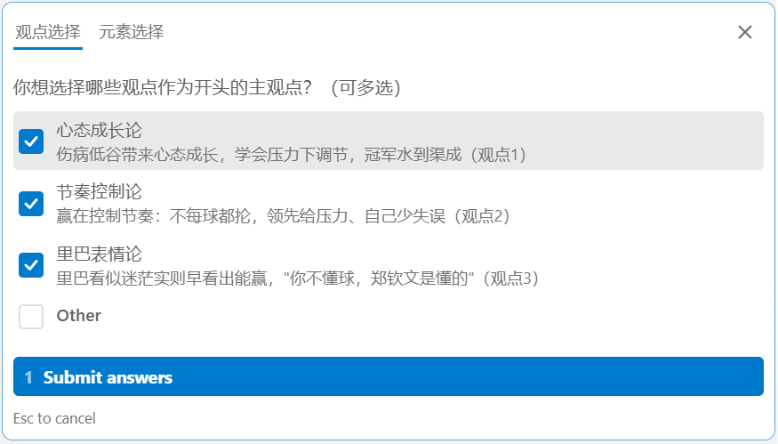
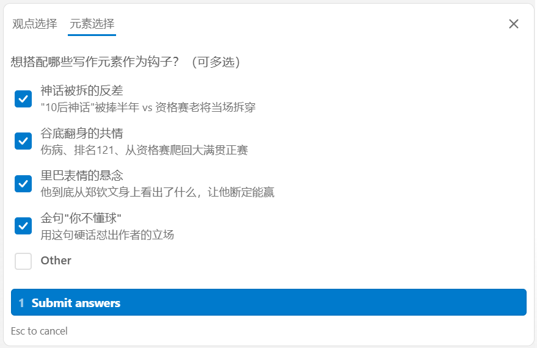
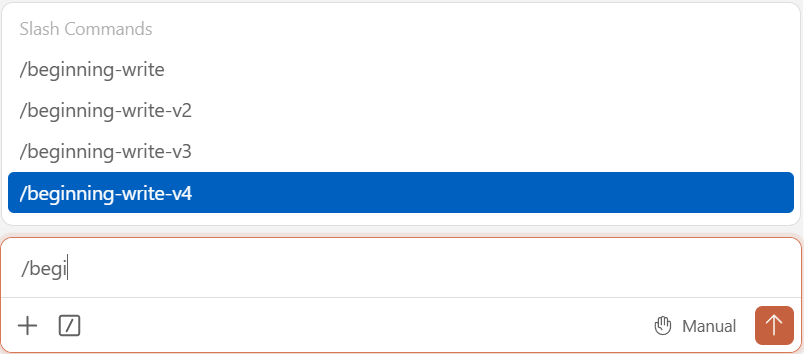
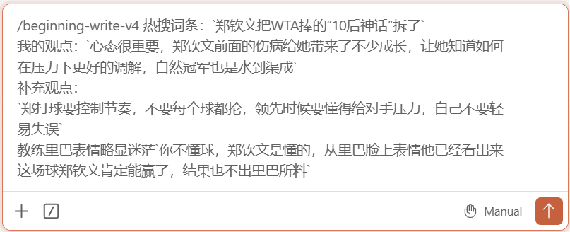
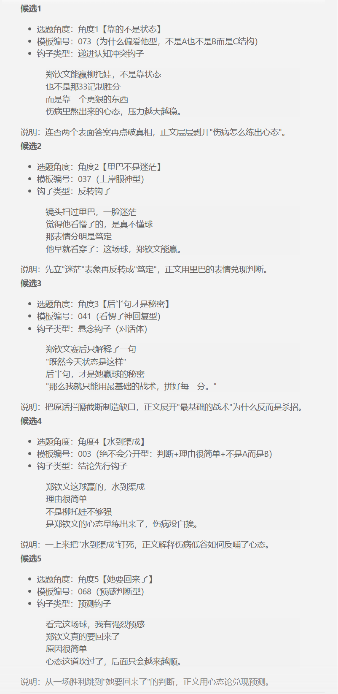

# 指南底稿

## 动笔前明确（准备过程，不应出现在交付中）

1. 用户是谁？装好skill，有一定AI使用经验的用户
2. 最核心的3个高频场景是什么？不知道写什么
    - 如果是不知道写哪个话题，可以用提示词筛选出范围；
    - 如果是这个热点能写什么，可以用skill提炼评论区观点，作为方向；
    - 如果是不知道怎么写，可以用skill套用模板
3. 用户最可能卡在哪一步？按照我自己的使用体验，可能卡在选择哪个生成的开头，要我说或许就全部用上比较好。

## skill手册标准结构

### 基础信息

skill一句话简介：该skill用于根据输入的信息，提炼观点，并套用模板，生成能提高点击率的微头条开头。
适用人群：会使用skill，不知道写什么内容、想减少写短内容时间、能够批量出结果的的用户

### 前置条件

素材来源：
    爬虫：通过脚本爬取热点，在网页大模型使用提示词筛选目标领域的热点话题，作为输入的内容
    自选：个人通过刷热榜、热点信息，通过内容及评论启发，想到的观点，作为输入的内容
输入要求：
    爬虫：需要话题词条+具体评论内容
    自选：需要具体事件描述+个人观点

### 快速上手，5分钟跑通

最简路径：
    输入：标准内容，包括词条或事件描述和具体评论或观点
    过程：在AI询问下确定选题方向、观点内容等
    输出：具体开头，选择心仪开头
输入输出示例（可复制）
成功标志：输出5个具体开头，语句通顺

### 输出不合格怎么办

合格/不合格的标准：文字类型生产没有准确的答案
对策：需要不断发布验证，从结果反馈形成自己的判断

### 常见错误如何排查

错误现象分类及解法：
    字数：手动增删、重新生成
    内容：手动修改、重新生成

### 最佳实践及技巧

避坑指南：尽量多次发布不要使用相同模板形式的标题，否则会违规（套模板）

### 版本修订更新记录

该指南：

|版本|时间|操作|人员|备注|
|---|---|---|---|---|
|V0.1|2026/08/27|目录编辑|本人|目录需检查|
|V0.2|2026/08/28|初稿编辑|本人|内容粗略，需充实|

## 临时内容
若素材来源爬虫：素材结构为话题词条 + 评论区观点

- 事件：使用词条本身
- 观点：3 - 5 个评论

有两条路可以选：

第一个是自己去热榜查看并选择。

第二个是通过脚本爬取信息并筛选。

素材来源：
    爬虫：通过脚本爬取热点，在网页大模型使用提示词筛选目标领域的热点话题，作为输入的内容
    自选：个人通过刷热榜、热点信息，通过内容及评论启发，想到的观点，作为输入的内容
输入要求：
    爬虫：需要话题词条+具体评论内容
    自选：需要具体事件描述+个人观点

    与事实相符、观点明确、不夸大、不攻击个人、符合平台字数与内容规范
偏离主题、观点太弱、语气不符、字数不符、重复度高、事实存疑，并追加修改指令

（待补充实际指令、样例输入、样例输出、选择标准）> 将上述每一步的输入、候选结果、选择理由和最终正文按时间顺序汇总。

示例：

